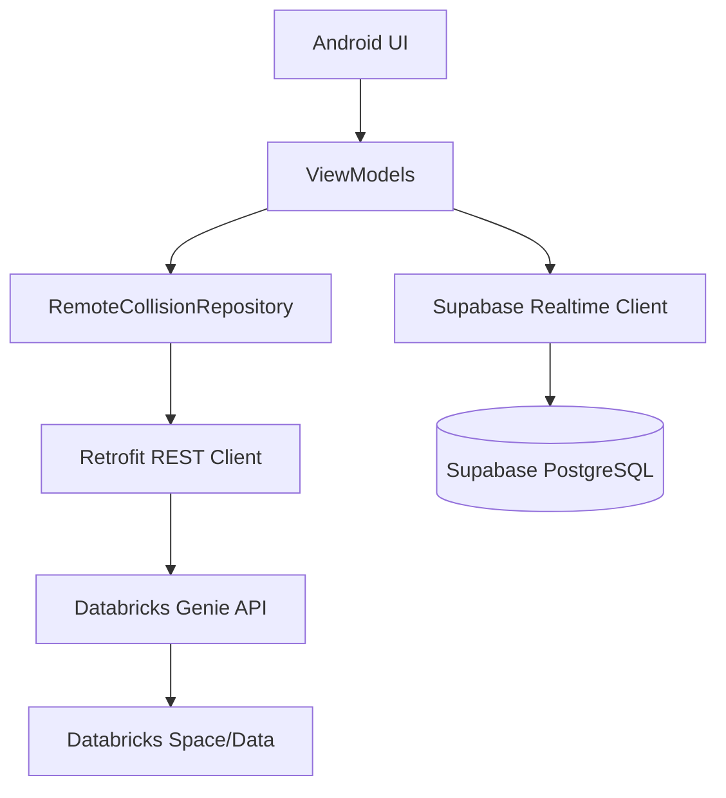

# Campus Connect: Implementation Plan

## 1. Project Overview
"Campus Connect" is a native Android application designed to facilitate campus discovery. Instead of acting like a chatbot, it helps students find others who have solved similar problems in research or placement contexts. Databricks Genie serves as the intelligence layer, analyzing overlapping attributes (skills, methodologies, company interviews, etc.).

## 2. Architecture Layout

### Phase 1: Local / Mock Architecture (Phases 1 - 10)
During the first half of the project, we rely entirely on local mock data.
```mermaid
graph TD
    UI[Android UI (Jetpack Compose)] --> VM[ViewModels (StateFlow)]
    VM --> Repo[MockCollisionRepository]
    Repo --> Data[Local JSON Datasets: Students, Projects, etc.]
```

### Phase 2: Remote / Production Architecture (Phases 11 - 20)
For the hackathon, we will connect the Android App directly to the Databricks Genie API using Retrofit to save time and reduce architectural complexity. We also rely on Supabase for real-time chat.



## 3. Data Strategy
- **Synthetic Data**: We've initialized `.json` placeholders in the `dataset/` directory. Each file aligns with the requested fields.
- **Databricks Medallion Architecture**:
  - **Bronze**: Raw data from campus systems/surveys.
  - **Silver**: Cleaned and normalized strings (e.g., standardizing "Machine Learning" vs "ML").
  - **Gold**: Ready-to-use profiles and materialized match data (`gold_student_profiles`, `gold_placement_profiles`, etc.).

## 4. Execution Rules
- **Strict Adherence**: Develop one phase at a time.
- **UI Quality**: Material 3, dynamic typography, clear badging (`🟢 VERIFIED` / `🟠 SYNTHETIC`).
- **Explanation over Score**: Highlight *why* the user matched (shared methods, shared domains) rather than providing a sterile percentage score.
