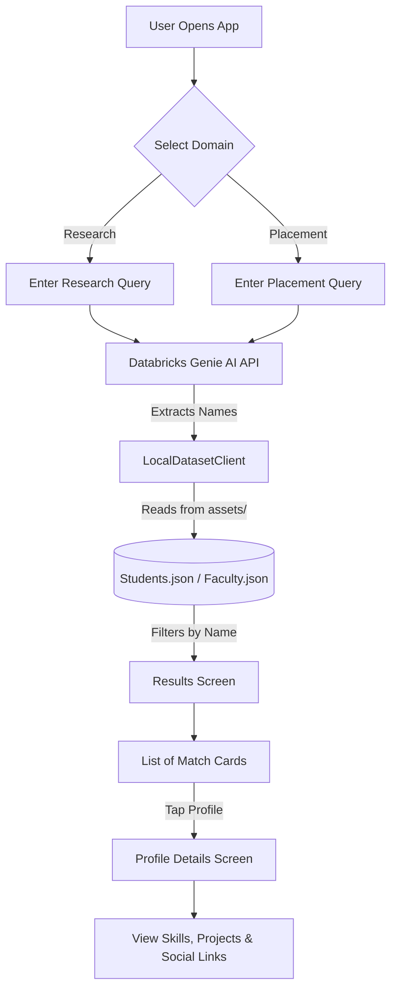

# Campus Connect AI

A native Android application designed to facilitate campus discovery and intelligent networking. Campus Connect helps students find peers and faculty who have solved similar problems in research or placement contexts, acting as a personal university matchmaker.

By analyzing overlapping attributes (skills, methodologies, company interviews, domains) using **Databricks Genie AI**, the app intelligently extracts candidates and cross-references them against an embedded offline dataset to give you rich, beautiful profile cards of exactly the right people on campus.

## 🌟 Key Features
- **Research Collisions:** Search for overlapping research topics, hardware (e.g., Raspberry Pi), and AI domains.
- **Placement Collisions:** Find seniors or peers who have interviewed at your target companies for specific roles.
- **Databricks Genie AI:** Powered by Databricks for fast, intelligent reasoning and entity extraction.
- **Offline Dataset Matching:** Lightning-fast profile matching using bundled JSON datasets.
- **Glassmorphic UI:** A premium, modern dark-themed profile UI built in Jetpack Compose.

---

## 📐 Architecture Flowchart



---

## 🛠️ Requirements

- **IDE:** Android Studio (Jellyfish or newer recommended).
- **Language:** Kotlin
- **Build System:** Gradle (Kotlin DSL)
- **UI Framework:** Jetpack Compose (Material 3)
- **Minimum SDK:** API 24
- **Target/Compile SDK:** API 35
- **Java Toolchain:** Java 17

## 🚀 How to Setup

1. **Clone the repository:**
   ```bash
   git clone https://github.com/k-anupam-sharma/CampusConnect.git
   cd CampusConnect
   ```

2. **Configure the Databricks API Key:**
   - Open `app/src/main/java/com/example/collisionengine/data/network/DatabricksClient.kt`
   - Paste your `DATABRICKS_HOST`, `DATABRICKS_TOKEN`, and `GENIE_SPACE_ID` into the constants at the top of the file. *(Ensure you do not commit these secrets to a public repository!)*

3. **Configure the Supabase Database:**
   - Create a new project on [Supabase](https://supabase.com/).
   - Open `app/src/main/java/com/example/collisionengine/data/network/SupabaseClient.kt`.
   - Update `SUPABASE_URL` and `SUPABASE_KEY` with your project's credentials.

4. **Open in Android Studio:**
   - Launch Android Studio and select **File -> Open**.
   - Navigate to the cloned directory and select it.

5. **Sync Gradle & Run:**
   - Click the **Sync Project with Gradle Files** icon (the little elephant).
   - Select an Android Emulator or physical device.
   - Click the green **Run 'app'** button (Shift + F10).
